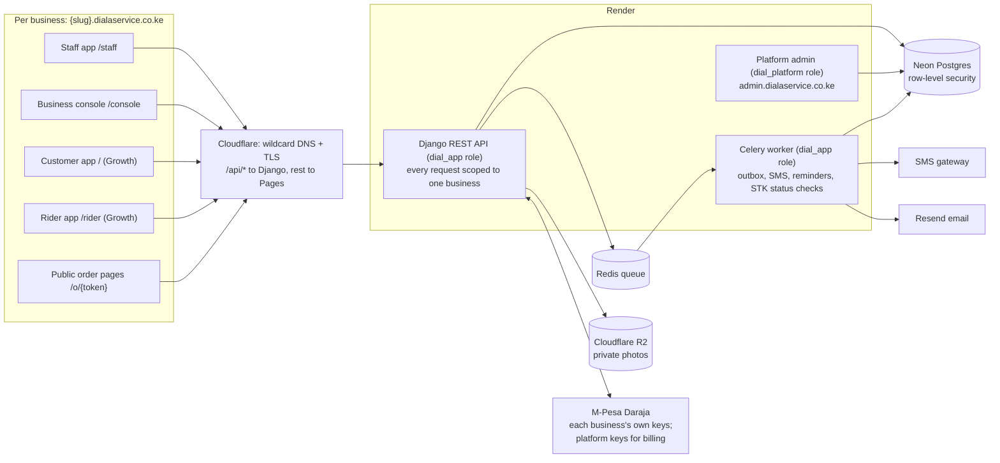
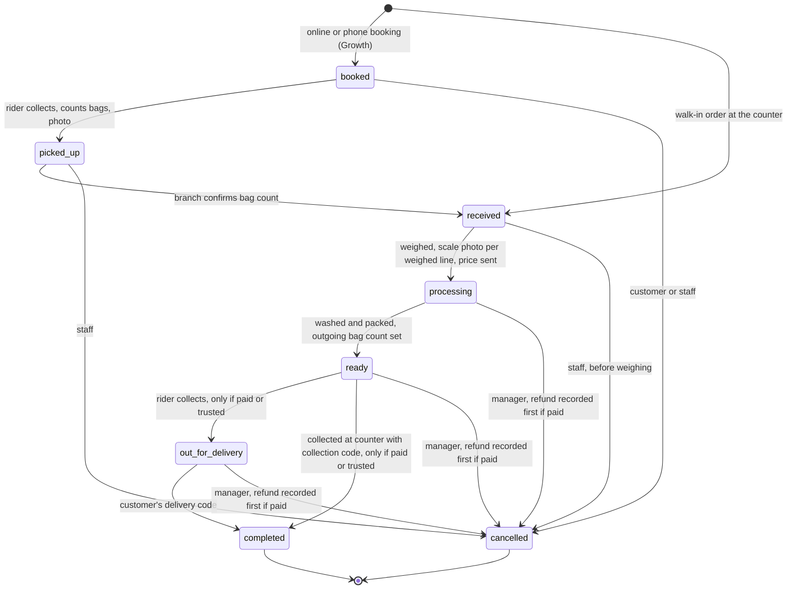
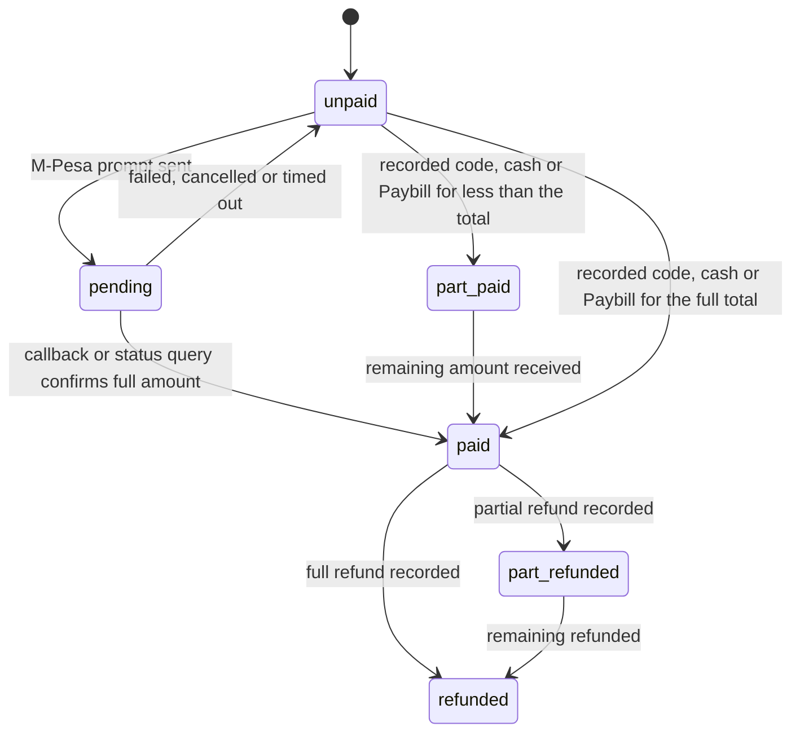

# Diagrams

These are text versions of the three diagrams in the design doc. The Markdown export replaces diagrams with placeholders, so this file is the source Claude Code reads.

## 1. Architecture: one API serves every business, each kept separate



## 2. Order state machine: every order passes the counter and leaves only when paid



Payment status runs alongside the order status:



## 3. Payment flow for a connected business: only the M-Pesa result can mark an order paid

```mermaid
sequenceDiagram
  autonumber
  participant S as Staff app
  participant C as Customer phone
  participant A as Dial A Service API
  participant D as M-Pesa Daraja (business keys)

  S->>A: record weight and scale photo (POST /staff/orders/{ref}/weigh)
  A->>A: pricing.py computes total; order becomes processing
  A-->>C: SMS: weight, price, link to /o/{token} (via outbox)
  C->>A: tap Pay on C-61 (or staff sends prompt from S-42)
  A->>A: create PaymentAttempt (pending), amount from stored total
  A->>D: STK Push with business shortcode and passkey
  D-->>C: PIN prompt
  D->>A: callback to /payments/mpesa/stk/{business token}
  A->>A: match CheckoutRequestID, lock row, ignore if already final, check amount
  A->>A: mark paid once, write balanced ledger transaction, outbox receipt SMS
  A-->>C: receipt SMS with link to C-62
  A-->>S: order shows Paid, release enabled
  Note over A,D: No callback in time: worker runs an STK status query and applies the result through the same code path
```

**Basic businesses** (no Daraja yet): the customer pays the business's Till or Paybill directly. Staff record the M-Pesa code and amount on S-42 after seeing the payment in the business's own M-Pesa messages. The code must match Safaricom's format and be unused in this business, and it is recorded against the staff member and device.
